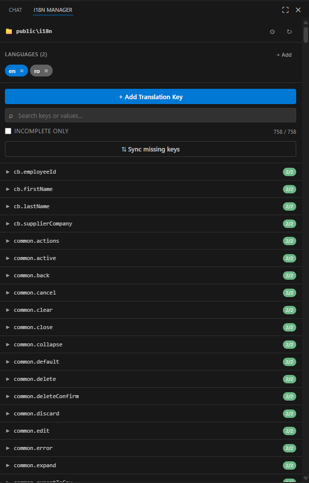
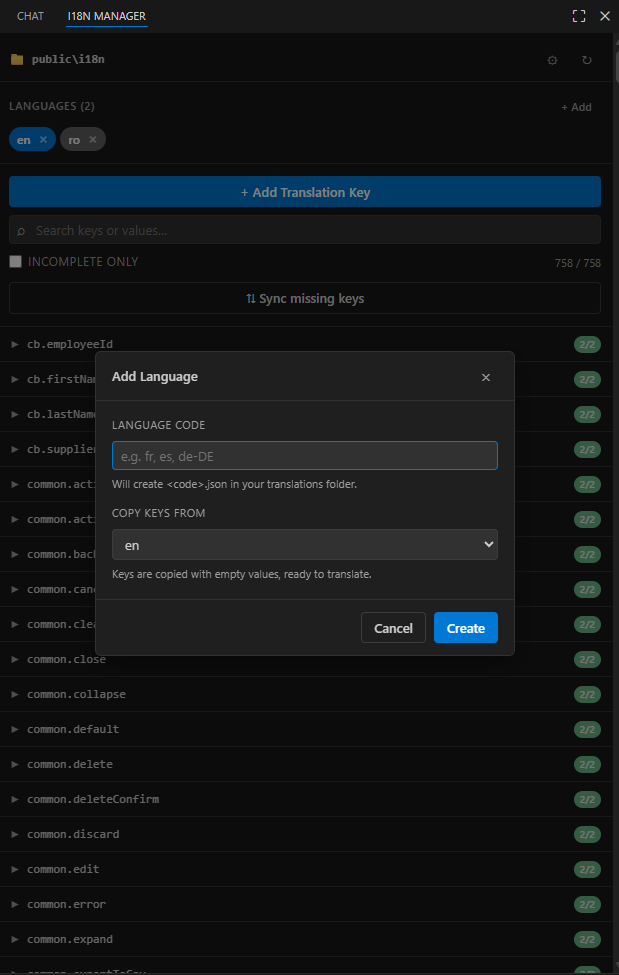

# i18n Manager

[](https://marketplace.visualstudio.com/items?itemName=MMLTECH.i18n-manager)
[](https://marketplace.visualstudio.com/items?itemName=MMLTECH.i18n-manager)
[](https://marketplace.visualstudio.com/items?itemName=MMLTECH.i18n-manager)
[](LICENSE)

A clean, sidebar-based control panel for managing your i18n translation files.
Add new keys to **every language file at once**, create new language files in a click,
spot missing translations at a glance, and translate them with a single click using
GitHub Copilot or any other VS Code language model, all without leaving VS Code.

## Features

- **Sidebar control panel** - a dedicated activity-bar view with everything you need.
- **Configure once** - point it at the folder where your `*.json` translation files live (per-workspace setting).
- **One key, all languages** - adding a new translation key writes to every language file in sync.
- **Inline editing** - click any key to expand and edit values for every language right in the sidebar. Saves on blur or `Ctrl/Cmd+Enter`.
- **AI translation (optional)** - one-click translate via the VS Code Language Model API. Works with GitHub Copilot or any other installed LM provider. Translate a single language or all of them from a chosen source.
- **Add languages in a click** - new language files come pre-populated with all existing keys (empty, ready to translate).
- **Sync check** - find keys missing in some files and fill them in (with empty values) in one click.
- **Smart search** - filter by key name *or* by the value text in any language.
- **Incomplete-only filter** - instantly see what still needs translating.
- **Nested keys supported** - dot-notation in the UI (`common.buttons.submit`), nested JSON on disk.
- **Theme-aware** - uses VS Code's theme variables, so it matches whatever you've got.

## 📸 Preview

>
> ```markdown
> 
> 
> ```

## Getting started

1. Install the extension from the [VS Code Marketplace](https://marketplace.visualstudio.com/items?itemName=MMLTECH.i18n-manager).
2. Open a workspace that contains your translation files.
3. Click the 🌐 **i18n Manager** icon in the activity bar.
4. Click **Choose Translations Folder** and pick the folder containing your `en.json`, `fr.json`, etc.
5. Done, start adding keys and languages from the sidebar.

## AI translation

If you have **GitHub Copilot** (or any other VS Code language model provider) installed
and signed in, expand any translation key and you'll see two new actions:

- **✨ next to each language** translate just that language. You'll be prompted to
  pick which other language to translate **from** (the source). The model receives the
  source value and writes the translation directly into the target language's file.
- **✨ Translate all** in the key's actions row translate the same key into **every
  other language** at once. You pick the source language; if any target already has a
  value, you're asked whether to overwrite or only fill empties.

Notes:

- The extension uses the [VS Code Language Model API](https://code.visualstudio.com/api/extension-guides/language-model). Your prompts go to whichever provider you have installed, Anthropic isn't called directly, no API key is shipped, and the user (you) authorizes usage on first run.
- The buttons **only appear when a model is reachable**. If you don't have an LM provider, the extension works exactly as before, no buttons, no errors.
- Placeholders (`{name}`, `{{count}}`, `%s`, `%d`, ICU plurals, HTML tags) are preserved by the prompt. Always review machine translations before shipping, especially for shorter keys where context can be ambiguous.
- You can disable the AI buttons entirely via the `i18nManager.aiTranslate.enabled` setting, even when a model is available.

## Expected file layout

The extension expects one JSON file per language inside the configured folder. The filename
(without `.json`) is taken as the language code:

```
locales/
├── en.json
├── fr.json
├── es.json
└── de-DE.json
```

Both flat (`{ "hello": "Hi" }`) and nested (`{ "common": { "hello": "Hi" } }`) JSON are
supported. Nested files are flattened to dot-notation in the UI and re-nested on write,
preserving your existing structure.

## Keyboard shortcuts (inside the sidebar)

| Shortcut             | Action                                            |
| -------------------- | ------------------------------------------------- |
| `Ctrl/Cmd + Enter`   | Save the focused value field, or submit a modal. |
| `Esc`                | Revert the value being edited / close a modal.   |

## Settings

| Setting                              | Description                                                                                                                | Default |
| ------------------------------------ | -------------------------------------------------------------------------------------------------------------------------- | ------- |
| `i18nManager.translationsPath`       | Folder containing your `*.json` translation files (relative or abs.).                                                       | `""`    |
| `i18nManager.defaultLanguage`        | The "source" language. Shown first and used as template for new langs.                                                     | `"en"`  |
| `i18nManager.indent`                 | Spaces of indentation when writing JSON.                                                                                   | `2`     |
| `i18nManager.aiTranslate.enabled`    | Show the AI translation buttons. When no language model provider is installed, the buttons are hidden automatically.       | `true`  |

These settings are written to your **workspace** settings, so each project can have its own config.

## Commands

Available from the Command Palette (`Ctrl/Cmd+Shift+P`):

- `i18n Manager: Configure Translations Folder`
- `i18n Manager: Refresh`

## Build from source

```bash
git clone https://github.com/mmlTools/i18n-manager.git
cd i18n-manager
npm install
npm run compile
```

Then open the folder in VS Code and press **F5** to launch the Extension Development Host.

See [CONTRIBUTING.md](CONTRIBUTING.md) for the full dev workflow.

## Package & publish

```bash
npm install -g @vscode/vsce
npm run package        # → i18n-manager-1.1.0.vsix
npm run publish        # publishes to the marketplace (requires `vsce login`)
```

## Requirements

- VS Code **1.90.0** or later (required for the Language Model API).
- For AI translation: any installed VS Code language model provider for example, [GitHub Copilot](https://marketplace.visualstudio.com/items?itemName=GitHub.copilot). The rest of the extension has no extra dependencies.

## Known limitations

- Only `.json` files are supported (not `.yaml`, `.po`, `.properties`, etc.).
- Pluralization rules (CLDR plural categories) aren't handled, values are treated as plain strings.
- Comments in JSON files aren't preserved (standard `JSON.parse` / `JSON.stringify`).
- AI translation quality depends on the underlying language model and the amount of context in the source string. Always review output for short or ambiguous keys.

## Changelog

See [CHANGELOG.md](CHANGELOG.md) for the full version history.

## License

[MIT](LICENSE) © StreamRsc.com
