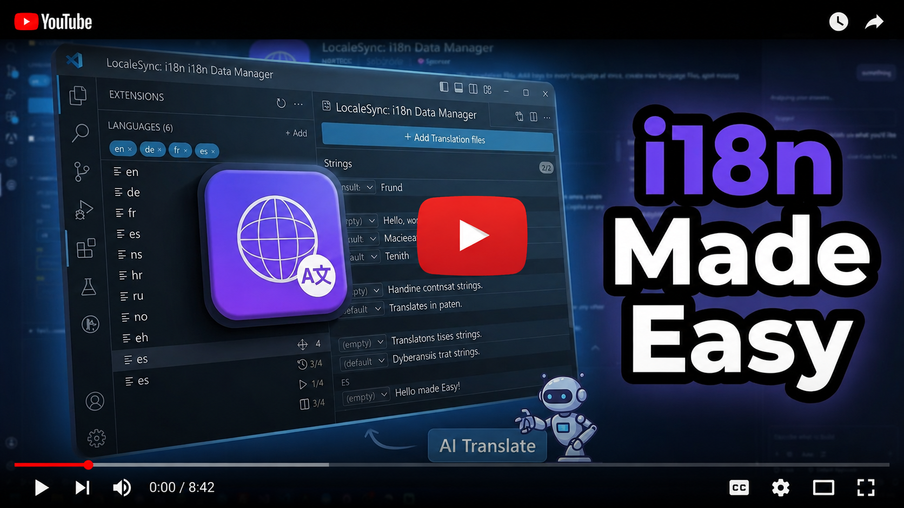

# LocaleSync: i18n Data Manager

[](https://marketplace.visualstudio.com/items?itemName=MMLTECH.localesync-i18n)


[](LICENSE)

A clean, sidebar-based control panel for managing your i18n translation files.
Add new keys to **every language file at once**, create new language files in a click,
spot missing translations at a glance, and translate them with a single click using
GitHub Copilot or any other VS Code language model, all without leaving VS Code.

<p align="center">
  <a href="https://youtu.be/K5xDWOrtAsA">
    
  </a>
</p>

## Features

- **Sidebar control panel** - a dedicated activity-bar view with everything you need.
- **Configure once** - point it at the folder where your `*.json`, `*.ini` or **CodeIgniter 4** PHP language files live (per-workspace setting).
- **One key, all languages** - adding a new translation key writes to every language file in sync.
- **Inline editing** - click any key to expand and edit values for every language right in the sidebar. Saves on blur or `Ctrl/Cmd+Enter`.
- **AI translation (optional)** - one-click translate via the VS Code Language Model API. Works with GitHub Copilot or any other installed LM provider. Translate a single language or all of them from a chosen source.
- **Translate from the editor** - select any string in your code, right-click → **i18n: Translate Selection…**. The extension recognises both **plain values** and **existing key paths** (it tells you when a translation already exists), suggests sibling keys whose last segment matches, and lets you reuse a key or create a new one on the fly (with optional AI translation into every language). The selection is replaced with the key path itself by default (configurable via `LocaleSynci18n.keyInsertTemplate`).
- **AI key naming from selection** - select any free-form text, right-click → **i18n: Create Translation Key from Selection (AI)** and the model proposes a nicely-nested key path (e.g. *"Fixed the card files uploads by removing the redundant webkit building"* → `fixes.redundantText`), reusing your existing top-level groups when they fit. The key is created, translated into every language, and the selection is replaced with the configured template in one step.
- **Auto-translate new languages** - when adding a new language file, tick **Auto-translate values with AI** and every key is translated from your source language. Translation is **batched** (many keys per AI request) so even large files complete in seconds rather than minutes.
- **Add languages in a click** - new language files come pre-populated with all existing keys (empty, ready to translate).
- **Sync check** - find keys missing in some files and fill them in (with empty values) in one click.
- **Smart search** - filter by key name *or* by the value text in any language.
- **Incomplete-only filter** - instantly see what still needs translating.
- **Nested keys supported** - dot-notation in the UI (`common.buttons.submit`), nested JSON / PHP arrays on disk, and flat dotted keys in INI files.
- **Three file formats supported** - JSON (`en.json`), OBS-style INI (`en-US.ini`) and CodeIgniter 4 PHP arrays (`app/Language/en/Messages.php`). The format is auto-detected from your folder layout.
- **Theme-aware** - uses VS Code's theme variables, so it matches whatever you've got.

## 📸 Preview


## Getting started

1. Install the extension from the [VS Code Marketplace](https://marketplace.visualstudio.com/items?itemName=MMLTECH.localesync-i18n).
2. Open a workspace that contains your translation files.
3. Click the 🌐 **i18n Data Manager** icon in the activity bar.
4. Click **Choose Translations Folder** and pick the folder containing your `en.json`, `fr.json`, `en-US.ini`, etc. — or your CodeIgniter 4 `app/Language/` folder.
5. Done, start adding keys and languages from the sidebar.

## AI translation

If you have **GitHub Copilot** (or any other VS Code language model provider) installed
and signed in, expand any translation key and you'll see two new actions:

- **✨ next to each language** translate just that language. You'll be prompted to
  pick which other language to translate **from** (the source). The model receives the
  source value and writes the translation directly into the target language's file.
- **✨ Translate all** in the key's actions row translate the same key into **every
  other language** at once. You pick the source language; if any target already has a
  value, you're asked whether to overwrite or only fill empties.
- **Translate Selection from the editor** - select a string OR an existing key
  path, right-click and choose **i18n: Translate Selection…**. The extension:
  - Tells you when the selection is **already a key** in your translations and
    previews each language's value.
  - Lists keys whose **value** matches the selection (so you can reuse them).
  - Lists keys whose **last segment** matches the selection's last segment
    (e.g. selecting `accessCategoryTypeNameHeader` surfaces every key ending
    in `.accessCategoryTypeNameHeader`).
  - Otherwise lets you create a new key (the *new key* input is pre-filled
    with the selection when it looks like a path; otherwise the *source
    value* input is pre-filled). Optionally translates the new key into every
    other language.
  - Replaces the selection according to the `LocaleSynci18n.keyInsertTemplate`
    setting (default `${key}` — just the key path; set it to something like
    `t('${key}')` if your codebase needs a wrapper).
- **Auto-translate when creating a new language file** - the *Add Language*
  dialog includes an **Auto-translate values with AI** checkbox (shown when a
  model is available). When checked, every value is translated from the
  chosen source language right after the file is created. Translation is
  **batched** (many keys per AI request) so even large dictionaries finish in
  seconds rather than minutes; if a batch reply can't be parsed, the affected
  entries fall back to per-key translation automatically.

Notes:

- The extension uses the [VS Code Language Model API](https://code.visualstudio.com/api/extension-guides/language-model). Your prompts go to whichever provider you have installed, Anthropic isn't called directly, no API key is shipped, and the user (you) authorizes usage on first run.
- The buttons **only appear when a model is reachable**. If you don't have an LM provider, the extension works exactly as before, no buttons, no errors.
- Placeholders (`{name}`, `{{count}}`, `%s`, `%d`, ICU plurals, HTML tags) are preserved by the prompt. Always review machine translations before shipping, especially for shorter keys where context can be ambiguous.
- You can disable the AI buttons entirely via the `LocaleSynci18n.aiTranslate.enabled` setting, even when a model is available.

## Expected file layout

The extension supports three layouts. Pick whichever matches your project — the
**format is auto-detected** from what's on disk.

### Flat (JSON / INI)

One translation file per language inside the configured folder. The filename
(without `.json` or `.ini`) is taken as the language code:

```
locales/
├── en.json
├── fr.json
├── es.ini
└── de-DE.ini
```

Both flat (`{ "hello": "Hi" }`) and nested (`{ "common": { "hello": "Hi" } }`) JSON are
supported. Nested files are flattened to dot-notation in the UI and re-nested on write,
preserving your existing structure.

INI files are supported in the OBS-style flat format:

```ini
Common.Scoreboard="Scoreboard"
Common.MatchStats="Match stats"
Common.SaveAndClose="Save && Close"
```

When you edit or add keys in an INI language file, values are written back as quoted
`key="value"` lines.

### CodeIgniter 4 (PHP arrays)

Point the extension at your `app/Language/` folder. Each locale is a
**subdirectory**, and each PHP file inside is a "group" (`Messages.php`,
`Buttons.php`, …) that returns a PHP associative array:

```
app/Language/
├── en/
│   ├── Messages.php
│   └── Buttons.php
└── es/
    ├── Messages.php
    └── Buttons.php
```

```php
<?php

return [
    'welcome'   => 'Welcome back, {name}!',
    'itemCount' => 'There are {0, number} items in your cart.',
];
```

In the sidebar, keys are displayed as `Group.subkey` (e.g. `Messages.welcome`,
`Buttons.warnLabel`) — the same shape you use in code:

```php
echo lang('Messages.welcome', ['name' => 'Alex']);
echo lang('Buttons.warnLabel');
```

The CodeIgniter 4 layout is **auto-detected** when the configured folder has
locale-named subdirectories (`en`, `es`, `pt_BR`, …) containing `.php` files,
and is offered as a one-click suggestion in the empty state when the extension
finds an `app/Language/` folder in your workspace.

Features specific to PHP mode:

- **Group → file mapping** — the first dot-segment of a key (e.g. `Messages` in
  `Messages.welcome`) is the PHP filename. Renaming the prefix moves the key
  to a different group file automatically. When a group becomes empty the
  file is deleted.
- **Nested arrays** — keys like `Messages.errors.notFound` are written back as
  nested PHP arrays inside `Messages.php`. Plain dotted keys stay flat.
- **`lang('Group.key')` recognised in code** — hover, CodeLens, diagnostics,
  *Find Unused Keys*, *Rename Globally*, *Show Key References* and the
  *Translate Selection* commands all work inside `.php` files.

## Keyboard shortcuts (inside the sidebar)

| Shortcut             | Action                                            |
| -------------------- | ------------------------------------------------- |
| `Ctrl/Cmd + Enter`   | Save the focused value field, or submit a modal. |
| `Esc`                | Revert the value being edited / close a modal.   |

## Settings

| Setting                              | Description                                                                                                                | Default |
| ------------------------------------ | -------------------------------------------------------------------------------------------------------------------------- | ------- |
| `LocaleSynci18n.translationsPath`       | Folder containing your `*.json`, `*.ini` or CodeIgniter 4 PHP language files (relative or abs.).                            | `""`    |
| `LocaleSynci18n.defaultLanguage`        | The "source" language. Shown first and used as template for new langs.                                                     | `"en"`  |
| `LocaleSynci18n.indent`                 | Spaces of indentation when writing JSON.                                                                                   | `2`     |
| `LocaleSynci18n.aiTranslate.enabled`    | Show the AI translation buttons. When no language model provider is installed, the buttons are hidden automatically.       | `true`  |
| `LocaleSynci18n.keyInsertTemplate`      | Template used to replace the selection when running **Translate Selection** / **Create Translation Key from Selection**. Use `${key}` as the placeholder. Example: `"t('${key}')"` if you want a wrapper. | `"${key}"` |

These settings are written to your **workspace** settings, so each project can have its own config.

## Commands

Available from the Command Palette (`Ctrl/Cmd+Shift+P`) and the editor context menu:

- `i18n Data Manager: Configure Translations Folder`
- `i18n Data Manager: Refresh`
- `i18n: Translate Selection…` - also available by right-clicking a selection in any text editor.
- `i18n: Create Translation Key from Selection (AI)` - also available by right-clicking a selection. Asks AI for a nicely-nested key path, creates the key with the selection as its source value, and translates it to every other language.

## Build from source

```bash
git clone https://github.com/mmlTools/localesync-i18n.git
cd localesync-i18n
npm install
npm run compile
```

Then open the folder in VS Code and press **F5** to launch the Extension Development Host.

See [CONTRIBUTING.md](CONTRIBUTING.md) for the full dev workflow.

## Package & publish

```bash
npm install -g @vscode/vsce
npm run package        # → localesync-i18n-1.1.0.vsix
npm run publish        # publishes to the marketplace (requires `vsce login`)
```

## Requirements

- VS Code **1.90.0** or later (required for the Language Model API).
- For AI translation: any installed VS Code language model provider for example, [GitHub Copilot](https://marketplace.visualstudio.com/items?itemName=GitHub.copilot). The rest of the extension has no extra dependencies.

## Known limitations

- Only `.json`, `.ini` and CodeIgniter 4 `.php` array files are supported (not `.yaml`, `.po`, `.properties`, etc.).
- Pluralization rules (CLDR plural categories) aren't handled, values are treated as plain strings.
- Comments in JSON files aren't preserved (standard `JSON.parse` / `JSON.stringify`); comments in INI and CI4 PHP files are not preserved when the file is rewritten.
- CI4 PHP language files are rewritten in short-array (`[ ... ]`) syntax with single-quoted strings; if your file used `array(...)` syntax or double-quoted strings, the syntax will be normalised on the next write (values are preserved verbatim).
- AI translation quality depends on the underlying language model and the amount of context in the source string. Always review output for short or ambiguous keys.

## Changelog

See [CHANGELOG.md](CHANGELOG.md) for the full version history.

## License

[MIT](LICENSE) © StreamRsc.com
